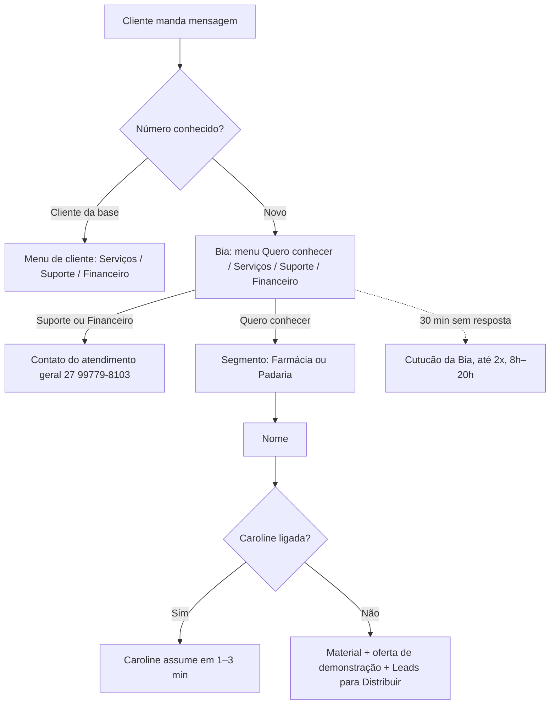
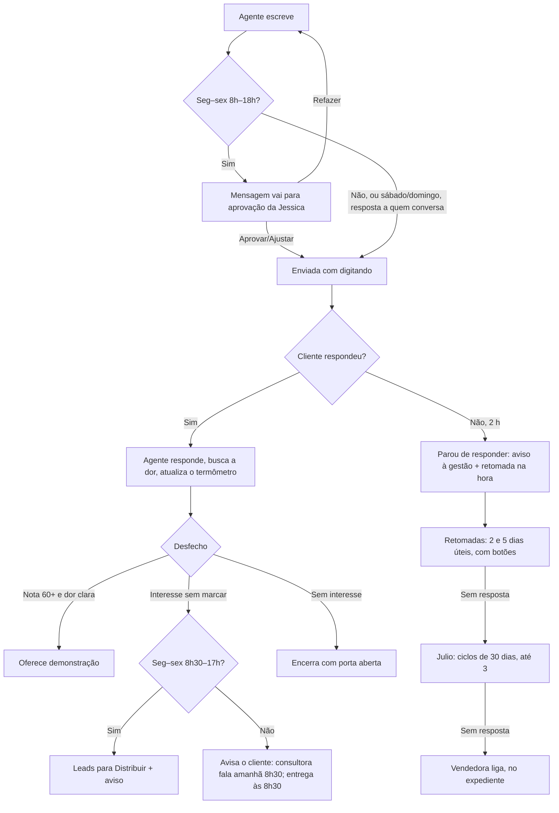
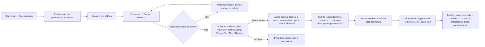

# App flow: CRM Comercial Prosystem

Fluxos do usuário e do cliente · versão 1.0 · 27/09/2026

## 1. Mapa de telas

| Área | Telas principais |
|---|---|
| Comercial | Dashboard, Leads, Leads SDR, Funil, Pipeline comercial, Propostas comerciais, Contratos, Metas, Comissões, Previsão, Ranking |
| Atendimento | WhatsApp (Conversas, Fila de chamados), Atividades, Agenda |
| Agentes | Escritório virtual (sala, agenda de cada agente, painéis da Caroline/Luiz Felipe/Julio, Caderno da Laya, Pesquisas da Sofia) |
| Gestão | Painel CEO, Indicadores, Painel da TV, Relatório comercial, Análise comercial |
| Pós-venda | Implantações, Clientes, Health score, NPS, Churn |
| Sistema | Configurações, Usuários, Auditoria, Manual |

## 2. Fluxo do cliente que chama no WhatsApp

## 3. Fluxo da conversa com um agente (Caroline, Julio, Luiz Felipe)

**Em qualquer ponto:** uma pessoa assume ou responde → os agentes param → ela recebe o resumo no WhatsApp → o lead sai da distribuição.

## 4. Fluxo do Julio (follow-up de leads)

1. Às 9h de seg 28/09 em diante, a fila é abastecida com 2 leads por vez: abertos, com celular, do mais novo para o mais antigo, sem conversa nos últimos 7 dias e sem proposta aberta.
2. Primeiro contato (respeitando o limite único do dia): "como está a rotina, já resolveu a questão do sistema?".
3. Já fechou com outro sistema → anota qual e por quê → encerra.
4. Interesse (nota 35+, "Quero saber mais", "Me chama depois") → **passa para a Caroline**.

## 5. Fluxo do Luiz Felipe (propostas)

1. Proposta enviada pelo WhatsApp → follow-up nos dias 2, 5 e 7.
2. Proposta parada há mais de 7 dias (enviada, visualizada, em negociação, expirada) → retomada pela IA: avaliou? dúvida? fechou com outro?
3. Quer negociar ou fechar → consultora dele é avisada (Luiz nunca fala de valores).

## 6. Fluxo da proposta

## 7. Fluxo do "Me chama depois"

Lead toca **Me chama depois** → nota mínima 35 (morno) → agente oferece **próximo dia útil de manhã ou à tarde** → lead escolhe → confirmação → agente chama às 9h30 ou 14h30 lembrando o combinado.

## 8. Fluxos da supervisora

- **Passar leads para a Caroline:** Escritório → painel da Caroline → colar → Conferir → Confirmar.
- **Aprovar mensagens:** painel do agente → Aprovar / ajustar / 🔄 Refazer ("o que mudar?").
- **Ensinar a Laya:** conversa → painel da Laya → Confirmar ou corrigir (meta 15/dia; lembrete 17h).
- **Assumir:** conversa → ✋ Assumir → recebe o resumo no WhatsApp.
- **Finalizar:** ✅ Finalizar → volta sozinha se o contato escrever.
- **Anotar ligação:** 📝 Observações (CNPJ é consultado na Receita).
- **Acompanhar agentes:** clicar no agente → 📅 Agenda.

## 9. Fluxo da gestão (diretoria)

- 18h (seg–qui): resumo do dia por e-mail e WhatsApp; sexta: resumo da semana com eficiência.
- Novo contrato assinado: aviso no WhatsApp.
- Comandos: `hoje`, `semana`, `propostas paradas`, `cliente …`, `tarefa …`.
