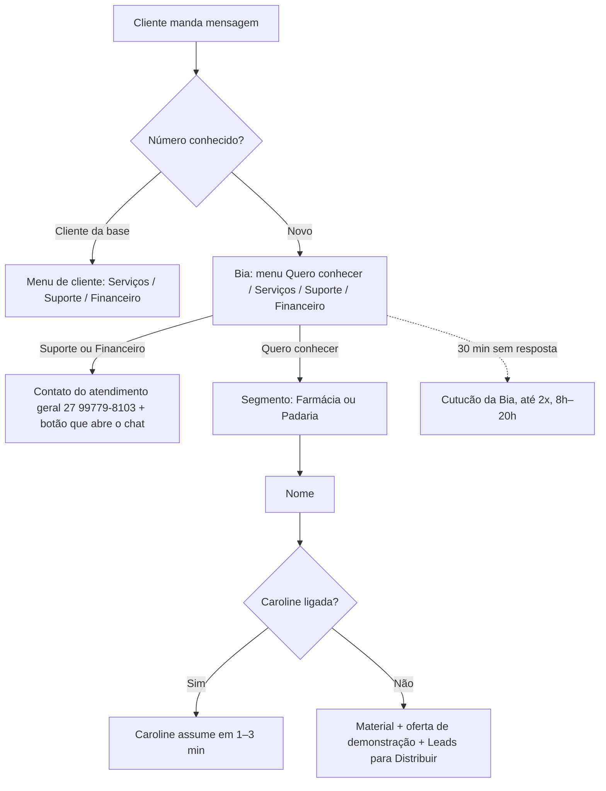
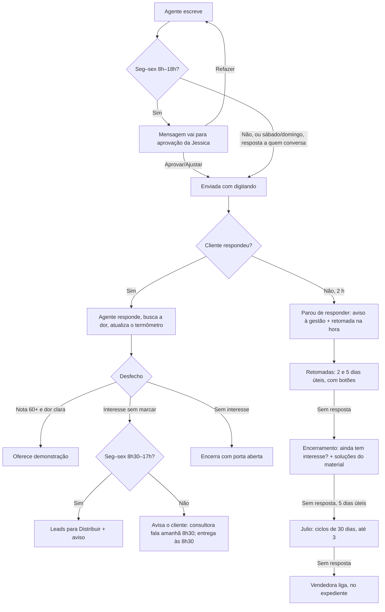
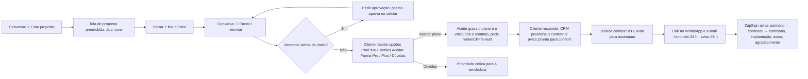

# App flow: CRM Comercial Prosystem

Fluxos do usuário e do cliente · versão 1.0 · 27/09/2026

## 1. Mapa de telas

| Área | Telas principais |
|---|---|
| Comercial | Dashboard, Leads, Leads SDR, Funil, Pipeline comercial, Propostas comerciais, Contratos, Metas, Comissões, Previsão, Ranking |
| Atendimento | WhatsApp (Conversas, Fila de chamados), Atividades, Agenda |
| Agentes | Escritório virtual (sala, agenda de cada agente, painéis da Caroline/Luiz Felipe/Julio, Caderno da Laya, Pesquisas da Sofia) |
| Gestão | Painel CEO, Indicadores, Painel da TV, Relatório comercial, Análise comercial |
| Pós-venda | Implantações, Clientes, Health score, NPS, Churn |
| Sistema | Configurações, Usuários, Auditoria, Manual |

## 2. Fluxo do cliente que chama no WhatsApp

## 3. Fluxo da conversa com um agente (Caroline, Julio, Luiz Felipe)

**Em qualquer ponto:** uma pessoa assume ou responde → os agentes param → ela recebe o resumo no WhatsApp → o lead sai da distribuição.

## 4. Fluxo do Julio (follow-up de leads)

1. Às 9h de seg 28/09 em diante, a fila é abastecida com 2 leads por vez: abertos, com celular, do mais novo para o mais antigo, sem conversa nos últimos 7 dias e sem proposta aberta.
2. Primeiro contato (respeitando o limite único do dia): "como está a rotina, já resolveu a questão do sistema?".
3. Já fechou com outro sistema → anota qual e por quê → encerra.
4. Interesse (nota 35+, "Quero saber mais", "Me chama depois") → **passa para a Caroline**.

## 5. Fluxo do Luiz Felipe (propostas)

1. Proposta enviada pelo WhatsApp → follow-up nos dias 2, 5 e 7.
2. Proposta parada há mais de 7 dias (enviada, visualizada, em negociação, expirada) → retomada pela IA: avaliou? dúvida? fechou com outro?
3. Quer negociar ou fechar → consultora dele é avisada (Luiz nunca fala de valores).

## 6. Fluxo da proposta

## 7. Fluxo do "Me chama depois"

Lead toca **Me chama depois** → nota mínima 35 (morno) → agente oferece **próximo dia útil de manhã ou à tarde** → lead escolhe → confirmação → agente chama às 9h30 ou 14h30 lembrando o combinado.

## 8. Fluxos da supervisora

- **Passar leads para a Caroline:** Escritório → painel da Caroline → colar → Conferir → Confirmar.
- **Aprovar mensagens:** painel do agente → Aprovar / ajustar / 🔄 Refazer ("o que mudar?").
- **Ensinar a Laya:** conversa → painel da Laya → Confirmar ou corrigir (meta 15/dia; lembrete 17h).
- **Assumir:** conversa → ✋ Assumir → recebe o resumo no WhatsApp.
- **Finalizar:** ✅ Finalizar → volta sozinha se o contato escrever.
- **Anotar ligação:** 📝 Observações (CNPJ é consultado na Receita).
- **Acompanhar agentes:** clicar no agente → 📅 Agenda.
- **Notificação de conversas (💬 no topo):** só mensagens de hoje; clicar abre a conversa (`/whatsapp?c=<id>`), marca como lida e tira da lista.

## 9. Fluxo da gestão (diretoria)

- 18h (seg–qui): resumo do dia por e-mail e WhatsApp; sexta: resumo da semana com eficiência.
- Novo contrato assinado: aviso no WhatsApp.
- Comandos: `hoje`, `semana`, `propostas paradas`, `cliente …`, `tarefa …`.

### Atualização 28/09/2026: resposta em até 1 minuto e dúvidas
- Quando o lead ou cliente escreve, a resposta do agente (Caroline, Julio, Luiz Felipe) sai **na hora, sem aprovação, em qualquer horário**: o agente espera 20 s para juntar mensagens seguidas e responde em cerca de 30 a 50 s (máximo ~1 min).
- A aprovação ("Aprovar antes de enviar") vale só para o que o agente puxa sozinho: primeiro contato e retomadas. Retomadas de quem já conversou, fora do horário comercial ou no sábado, também saem direto.
- Dúvida do cliente: (1) o agente procura no material e responde; (2) se não entendeu a pergunta, pergunta mais ao cliente; (3) só se o material não cobrir, avisa que confirma com a equipe (acao `duvida_fora_material`).
- Técnico: `caroline.service.ts` (`semAprovacao` inclui toda `fase === "resposta"`, `ESPERA_MS = 20_000`); `lib/assistente/sdr.ts` (regra NÃO INVENTE NADA reescrita). Sem mudança de schema. Regra também gravada como instrução da equipe no Escritório virtual.

### Atualização 28/09/2026: desistência vira "perdido" com motivo + lista News + Instagram
- Quando o cliente diz que não quer, ou que já fechou com outro sistema, o agente se despede com a porta aberta (sem fazer pergunta nessa despedida) e a IA devolve `motivo_perda` (PRECO | JA_TEM_FORNECEDOR | SEM_ORCAMENTO | TIMING | SEM_INTERESSE | FUNCIONALIDADE_AUSENTE | OUTRO, as mesmas chaves do funil e do relatório comercial).
- Quando há proposta (Luiz Felipe) ou o motivo é JA_TEM_FORNECEDOR, `marcarPerdidoNews` (caroline.service.ts) faz o seguinte:
  - Lead: `status/etapa_funil/etapa_comercial = PERDIDO`, `motivo_perda` recebe "CHAVE: o que o cliente disse", e uma linha é gravada em `LeadPerda`. Se a proposta não tiver lead vinculado, o sistema acha o lead pelo celular (últimos 8 dígitos) ou cria um com origem PROPOSTA.
  - Proposta: `status = PERDIDA` e uma linha em `PropostaHistorico` (tipo STATUS, com o motivo).
  - Etiqueta do sistema **News** (roxa, `sistema=true`) aplicada ao lead.
  - Mensagem automática com o Instagram: https://instagram.com/prosystemoficial.
- Campanhas (Zequinha): novo público **NEWS**, que reúne os leads com a etiqueta News e vem com um modelo de informativo que já traz o Instagram. O "SAIR" continua valendo.
- Sem mudança de schema (usa Etiqueta, LeadEtiquetaAplicada, LeadPerda e PropostaHistorico, que já existiam).

### Atualização 28/09/2026: vídeos e suporte vão para o setor de suporte
- Se o cliente pede vídeos (tutoriais, treinamento, "como usar"), ajuda técnica ou suporte, o agente (Caroline, Julio ou Luiz Felipe) usa a nova ação `encaminhar_suporte`, com `mensagens: []`, e não promete enviar vídeos.
- Em seguida o sistema envia o texto padrão `mensagemSuporte(agente)` (lib/assistente/sdr.ts): "O envio de vídeos, treinamentos e o suporte técnico são feitos pelo nosso setor de suporte. Eu sou o Luiz Felipe, do setor comercial…". A mensagem vai com o botão de link "💬 Falar com o suporte" (`LINK_CONTATO_GERAL`, o mesmo usado na triagem) e fica registrada na conversa.
- A função `encaminharSuporte` fica em caroline.service.ts. O lead continua em CONVERSANDO. Não há mudança de schema.

### Atualização 28/09/2026: conversa mais simples, direta e com os desafios da farmácia
- **Menos perguntas:** no máximo 2 perguntas de investigação na conversa inteira, e nunca repetir uma pergunta já respondida. Assim que o cliente diz qual é o problema, mesmo numa palavra ("demora"), o agente mostra em 1 ou 2 frases como o MATERIAL resolve e já oferece a demonstração (`oferecer_demo`, sem esperar a nota 60).
- **Resposta curta** ("nada", "isso") é tratada como sinal de pouca paciência: nada de mais perguntas abertas, o agente vai direto para a solução e a demonstração.
- **Pergunta direta:** "Qual é o maior problema que você quer resolver hoje na farmácia?", com o convite para explicar por áudio (os áudios são transcritos).
- **Dia a dia da farmácia (conhecimento geral)**, usado de forma natural, um exemplo por vez:
  - fila e demora no caixa;
  - estoque furado e remédio vencendo;
  - controlados e receitas (SNGPC);
  - convênios, PBM e Farmácia Popular;
  - fiado e crediário;
  - margem e preço;
  - cliente de uso contínuo que não volta;
  - fechamento de caixa;
  - nota fiscal e impostos.
- A solução para cada um desses problemas só vem do MATERIAL.
- Onde está no código: `promptCaroline` em lib/assistente/sdr.ts. Não há mudança de schema.

### Atualização 28/09/2026: pedido de prazo sempre com previsão + campanha/revisão com autorização
- **Luiz Felipe:** quando o cliente pede mais prazo, o agente nunca sai só agradecendo. Ele pede uma previsão ("pra quando você acha que consegue decidir? assim já te chamo nesse dia"), confirma a data e deixa a porta aberta.
- **Do dia 20 ao último dia do mês** (`janelaCampanhaAtiva`, horário de Brasília), ele também diz que temos campanhas ativas e que pode revisar a proposta, sem citar valores. Essa mensagem vem marcada com `revisar_proposta: true`, e aí:
  - ela sempre vai para "✋ Para você aprovar", mesmo sendo uma resposta;
  - a Jessica recebe um aviso no WhatsApp ("🙋 Autorização: … quer oferecer revisão da proposta") com o texto;
  - fora da janela, uma mensagem com essa marcação é descartada e nunca sai.
- **Código:** `promptCaroline` (parâmetro `janelaCampanha`) e `lerRespostaCaroline` em lib/assistente/sdr.ts; `falar` em caroline.service.ts. Não há mudança de schema.

### Atualização 28/09/2026: máquina de negociação do Luiz Felipe (autorização por botão no WhatsApp)
- **Pedido de autorização:** quando o Luiz marca uma mensagem com `revisar_proposta` (entre o dia 20 e o fim do mês, uma vez por mês por cliente), a mensagem fica PENDENTE e `pedirAutorizacaoNegociacao` (assistente-negociacao.service.ts) envia para a gestão, só a quem recebe o aviso `lead_qualificado` (o Thiago não recebe), um menu com:
  - a prévia da proposta: empresa, contato, plano, mensalidade, implantação e link;
  - a mensagem que vai para o cliente;
  - as opções de desconto: implantação -30% ou -20% e mensalidade -10% por 12 meses, com os valores de antes e depois.
- **Botões** (`lib/assistente/negociacao.ts`): `neg_30_<msgId>` "✅ Autorizar 30%", `neg_20_<msgId>` "✅ Autorizar 20%" e `neg_0_<msgId>` "❌ Não autorizar". `responderComandoGestao` encaminha para `responderAutorizacaoNegociacao`:
  - **Autorizar:** grava `SdrLead.dados.desconto_autorizado` (impl_pct, mens_pct 10, meses 12, valores de antes e depois, quem autorizou) e `campanha_mes`, aprova a mensagem (`decidirMensagem`) e confirma para a gestora.
  - **Não autorizar:** a mensagem sai trocada só pelo pedido de previsão de decisão e o cliente fica marcado com `campanha_recusada` no mês.
- **Com desconto autorizado:** o prompt do Luiz recebe `instrucaoDescontoAutorizado`, que manda ser comercial e conduzir ao fechamento. Ele apresenta a condição só em porcentagem, como campanha válida até o fim do mês. Se o cliente topar, usa a ação `aceitar_condicao`.
- **`aceitar_condicao` → `aplicarCondicaoNaProposta`:**
  - na proposta: `desconto` = X% da implantação, `valor_final` recalculado, `condicao_especial` com a mensalidade -10% por 12 meses, `desconto_aprov_status=APROVADO`, status EM_NEGOCIACAO e histórico RENEGOCIACAO;
  - reenvio pelo WhatsApp (`enviarPropostaWhatsapp`) com os botões de aceite de sempre, mais o texto "Condição da campanha aplicada";
  - aviso 🔥 para a gestão.
- **Sem desconto autorizado,** o Luiz continua proibido de oferecer valores ou condições.
- Não há mudança de schema. Teste: tests/negociacao.test.ts.

### Atualização 28/09/2026: campanha negociada vale 5 dias corridos
- A condição autorizada vale `VALIDADE_CAMPANHA_DIAS = 5` dias corridos, contados a partir do momento da autorização (`desconto_autorizado.em`). As funções `validadeCampanha` e `campanhaVigente` ficam em lib/assistente/negociacao.ts.
- O Luiz apresenta a condição como "válida por 5 dias (até DD/MM)". O texto "Condição da campanha aplicada" mostra a mesma data, e a confirmação enviada à gestora também.
- Passados os 5 dias, a condição deixa de ir para o prompt e `aplicarCondicaoNaProposta` recusa a aplicação.
- A oferta ao cliente passou a dizer "campanha ativa por poucos dias", no lugar de "campanhas ativas este mês".

### Atualização 28/09/2026: cliente nunca fica órfão por mensagem mandada do celular
- **Causa:** a Jessica mandou uma mensagem pelo celular sem assumir a conversa no CRM. `pessoaAssumiu` tratava isso como se uma pessoa tivesse assumido: o agente virava HUMANO, a conversa ficava sem dono e ninguém respondia o cliente.
- **Correção em `pessoaAssumiu`** (caroline.service.ts): o dono no CRM continua valendo como assumido. Já uma mensagem humana sem dono só conta como "pessoa conversando" se tiver sido enviada nos últimos 10 minutos.
- **Correção em `aoReceberDoLead`:** o SdrLead HUMANO volta para CONVERSANDO e o agente responde quando as quatro condições valem:
  - o cliente escreveu;
  - a conversa não tem dono;
  - a conversa não foi finalizada;
  - ninguém conversou nos últimos 10 minutos.
- A regra "uma pessoa assumiu, nenhum agente responde" continua valendo para quem assume pelo CRM (fica como dono) e para a conversa finalizada.
- Não há mudança de schema.

### Atualização 28/09/2026: lembrete da demonstração para a responsável
- As demonstrações marcadas pelo lead já eram gravadas como Atividade (tipo REUNIAO, `created_by = lead_whatsapp`) e aparecem na Agenda da responsável: o dono da conversa ou, sem dono, a Supervisão Comercial.
- **Novo:** `lembrarResponsavelDemo` (assistente-demo.service.ts) roda no agendador do assistente a cada 10 minutos. Quando uma reunião ativa começa em até 75 minutos, a responsável recebe no WhatsApp dela um aviso com:
  - "⏰ Lembrete: demonstração às HH:MM";
  - o título da reunião;
  - o nome e o número do cliente;
  - o link da reunião ou, se não houver, um alerta para enviá-lo.
- O aviso chega entre 65 e 75 minutos antes, portanto sempre com pelo menos 1 hora de antecedência. É uma vez só por reunião (trava `lembrete_demo_resp.<id>`).
- O lembrete do cliente, 2 horas antes, continua como estava. Não há mudança de schema.

### Atualização 28/09/2026: CRM como app de iPhone no celular (etapa 1 de 4)
- **Base:** guia de interface da Apple (HIG iOS), usado a partir de `reference/ios.md` das skills impeccable e anti-ui-slop. Vale só abaixo de 768px; no computador nada muda.
- **Barra de abas embaixo** (`components/mobile/AppIOS.tsx` › `BarraAbasIOS`):
  - WhatsApp, Leads, Propostas (gerador), Dashboard e Mais;
  - material translúcido com blur e linha fina de separação;
  - alvos de toque de 44pt, ícones de 24px e rótulos de 10px;
  - cor de ação azul do sistema (#007AFF, ou #0A84FF no escuro);
  - área segura da barra de início respeitada.
  - Uma aba só aparece se a pessoa tiver permissão para a tela, pelo mesmo filtro do menu (`gruposVisiveis`).
- **Folha "Mais"** (`FolhaMaisIOS`): sobe de baixo com alça e botão fechar, e traz o título grande "Mais". Mostra todas as outras telas liberadas em listas agrupadas no estilo Ajustes (ícone em quadrado arredondado, linha de 44pt, seta), com animação de folha iOS e respeito a `prefers-reduced-motion`.
- **Estrutura:** o menu hambúrguer foi escondido (a aba "Mais" substitui). A barra de cima respeita o notch e a Dynamic Island. O conteúdo tem espaço embaixo para a barra de abas, e a fonte do sistema (San Francisco) vale no celular.
- **Estilos** em `app/ios.css`, com tokens `--ios-*` para os modos claro e escuro (`.dark`).
- **Instalação na tela inicial:**
  - `app/manifest.ts`: standalone, `start_url` /whatsapp, ícones de 192 e 512 (também maskable);
  - `apple-touch-icon.png` de 180px, com a marca ▶ da Prosystem sobre fundo branco;
  - `appleWebApp` com o título "CRM Prosystem".
- **Próximas etapas:**
  - 2: WhatsApp e Leads (títulos grandes, listas e folhas);
  - 3: Propostas e Dashboard;
  - 4: telas do "Mais".

### Atualização 28/09/2026: celular no padrão iOS, etapa 2 (WhatsApp e Leads)
Tudo vale só abaixo de 768px, com classes `ios-*` em `app/ios.css`. No computador nada muda.
- **WhatsApp, lista** (estilo app Mensagens):
  - título grande "WhatsApp" de 34pt;
  - Conversas/Fila e Minhas/Sem dono/Todas/Finalizadas viram controles segmentados;
  - campo de busca iOS (preenchimento cinza, 17pt);
  - linhas de 76pt com avatar de 52pt e separador recuado;
  - selo "Conectado" e faixa "WhatsApp da empresa" escondidos no celular.
- **WhatsApp, conversa** (estilo iMessage):
  - a barra de abas some (classe `ios-em-chat` no body);
  - barra de navegação translúcida com "‹ Conversas", nome, ⓘ (detalhes) e ⋯ (ações);
  - bolhas de 18pt de raio, enviadas em azul do sistema e recebidas em cinza #E9E9EB, texto de 17pt;
  - campo de mensagem em pílula na barra translúcida, com área segura.
- **Folha de ações ⋯** (padrão action sheet): Assumir, Finalizar/Reabrir, Detalhes do atendimento, Prioridade, Etiquetar, Agendar reunião, Vincular a cliente da base, Transferir, Desvincular do funil, Excluir (em vermelho) e Cancelar. A fileira de botões só aparece no computador (`hidden md:contents`).
- **Detalhes ⓘ:** o painel lateral (Criar proposta, Observações, IA, funil etc.) abre como folha em tela cheia, com cabeçalho "Detalhes" e botão OK (estado `painelMobile`).
- **Leads:**
  - título grande "Central de Leads";
  - busca iOS em linha própria;
  - filtros como pílulas em faixa rolável horizontal;
  - "Novo Lead" em azul do sistema;
  - funil com uma etapa por página (coluna com a largura da tela e rolagem com encaixe), navegando pelas setas de 44pt, pelos pontos ou deslizando.
  - O passo das setas passou a medir a largura real da coluna (`colWidth()`), o que vale para o computador e para o celular.
- **Próximas etapas:**
  - 3: Propostas (gerador) e Dashboard;
  - 4: telas do "Mais".

### Atualização 29/09/2026: celular no padrão iOS, etapa 3 (Propostas e Dashboard)
Tudo vale só abaixo de 768px (`app/ios.css`). No computador nada muda.
- **Classes genéricas para outras telas:**
  - `ios-tela`: fundo agrupado #F2F2F7; os `.ps-card` viram cartões iOS com raio de 12, sem borda e sem sombra.
  - `ios-topo`: cabeçalho em coluna, com título grande de 34pt e subtítulo de 15pt.
  - `ios-seg-inline` e `ios-abas`: controles segmentados.
  - `ios-filtros`: busca iOS em linha própria e campos de 36 a 44pt.
  - `ios-lista-cartoes`: a tabela vira lista de cartões, com cabeçalho escondido, uma linha por cartão e botões de ação de 44pt.
  - `ios-modal-*`: o modal vira folha em tela cheia.
- **Propostas (gerador):**
  - título grande "Gerador de Proposta Comercial";
  - Lista/Kanban como segmentado;
  - "Nova Proposta" em botão largo azul do sistema, com 44pt;
  - indicadores em cartões iOS;
  - lista de propostas em cartões: empresa em 17pt, detalhes em 15pt e ações Ver/Editar/Link/WhatsApp com 44pt.
- **Formulário da proposta em folha de tela cheia:**
  - barra de título translúcida com área segura e botão fechar redondo;
  - passos com 44pt e a cor de ação do sistema;
  - campos em uma coluna, de 17pt e 44pt de altura (o `gridColumn: span 2` do FormField é anulado no celular);
  - botões do rodapé com 44pt.
- **Dashboard:**
  - título grande "Dashboard Executivo";
  - filtros e Atualizar com 36pt;
  - abas (`AbaTabs`) como segmentado rolável, com a aba ativa em cartão branco;
  - cartões iOS;
  - barras horizontais com rótulo de 92px para caber na tela.
- **Próxima:** etapa 4, com as telas do "Mais" (Escritório, Agenda, Contratos etc.), usando as classes genéricas.

### Atualização 29/09/2026: notificações no celular, bolinha no ícone e tela "Aprovar"
- **Notificações (Web Push):**
  - Tabela nova `PushInscricao` (id, usuario_id, endpoint único de 700, p256dh, auth, aparelho, created_at, ultimo_ok), com um registro por aparelho.
  - Biblioteca `web-push` no backend.
  - Chaves VAPID (`VAPID_PUBLIC_KEY`, `VAPID_PRIVATE_KEY`, `VAPID_SUBJECT`) só no `.env` do servidor, com chmod 600.
  - `services/push.service.ts`: `enviarPush(prisma, usuarioIds, {titulo, corpo, url, tag})` envia a todos os aparelhos da pessoa, grava `ultimo_ok` e apaga inscrições vencidas (404/410). Nunca lança.
  - `contagemPendencias` soma aprovações pendentes (gestão), conversas sem dono com mensagens não lidas e não lidas das conversas da pessoa.
- **Rotas** (`routes/push.ts`):
  - `GET /push/chave`
  - `POST /push/inscrever`
  - `POST /push/cancelar`
  - `POST /push/teste`
  - `GET /push/contagem`
  - `GET /assistente/aprovacoes` (gestão)
  - `POST /assistente/aprovacoes/:id/negociacao` com {pct: 0 | 20 | 30}
- **Quem dispara notificação:**
  - `enviarAvisoGestao`: todo aviso que vai pelo WhatsApp da gestão também vira notificação. Abre /aprovar quando o texto fala de aprovação ou autorização; senão, /whatsapp.
  - `pedirAutorizacaoNegociacao`: "🙋 Luiz Felipe pede autorização de campanha", abrindo /aprovar.
  - `lembrarResponsavelDemo`: "⏰ Demonstração às HH:MM", abrindo /atividades.
- **Negociação:** `decidirNegociacao` foi separada de `responderAutorizacaoNegociacao` e é usada pelos botões do WhatsApp e pela tela Aprovar. A mensagem pendente guarda `negociacao: true` no meta.
- **Frontend:**
  - `public/sw.js`: service worker que recebe o push, mostra a notificação, atualiza a bolinha (`setAppBadge`) e abre a URL ao tocar.
  - `components/mobile/NotificacoesApp.tsx`: registra o service worker e mostra o aviso flutuante "Receba avisos no celular" (Ativar / Agora não). No iPhone fora do app, o aviso ensina a instalar na Tela de Início.
  - Ao ativar, o app pede permissão, inscreve o aparelho e manda um push de teste.
  - A bolinha no ícone é atualizada a cada 60 s e ao voltar para o app.
- **Tela `/aprovar`** (item "Aprovar" no menu, só gestão): cartões iOS com tudo o que espera decisão, de todos os agentes.
  - Mensagens: Aprovar e enviar / Editar (enviar com meu ajuste) / Refazer (o que mudar?).
  - Campanhas: Autorizar 30% / Autorizar 20% / Não autorizar.
  - Mostra o tempo de espera e o link "Ver conversa"; atualiza a cada 30 s.

### Atualização 29/09/2026: app do CEO e etapa 4 (telas do "Mais")
- **CEO no celular:**
  - Abas próprias (`ABAS_CEO` em AppIOS.tsx): Painel (/dashboard) · Análise (/analise-comercial) · Previsão (/previsao) · Leads · Mais. A folha "Mais" traz o resto das telas de leitura dele (CEO_VISIVEL).
  - Indicadores do Painel (`KpiCard`) como widgets do iPhone: raio de 20, rótulo de 13pt sem caixa alta, valor de 28pt (34pt no destaque) com números tabulares. O primeiro indicador de cada grade ocupa a largura toda.
  - Análise Comercial e Previsão com `ios-tela`, `ios-topo` e título grande. Tabelas largas rolam dentro do próprio cartão.
  - Notificações liberadas para a conta de consulta: `/push/inscrever`, `/push/cancelar` e `/push/teste` entraram em `ROTAS_ESCRITA_LIBERADAS_LEITURA`, porque só mexem no aparelho da própria pessoa.
  - O CEO recebe só os avisos que já escolheu (resumo diário e contrato assinado).
  - A bolinha do CEO não conta aprovações, porque quem aprova é a Supervisão Comercial ou o Admin.
- **O app abre na tela de cada pessoa:** o manifest agora tem `start_url` "/", e o início redireciona conforme o cargo (CEO e gestão → Painel/Dashboard; vendedora → Radar; SDR → funil).
- **Etapa 4:** Escritório virtual, Atividades, Agenda, Contratos, Clientes e Campanhas ganharam `ios-tela` (fundo agrupado e cartões iOS) e título grande de 34pt no celular. Com isso, o plano de 4 etapas do app iOS está concluído.

### Atualização 29/09/2026: revisão para todos os iPhones
- **Como foi revisado:** prints automáticos (Playwright com emulação de iPhone) nos tamanhos 17 Pro Max 440×956, Air 420×912, 17 e 17 Pro 402×874 e 16e/SE 375×667. Foram medidos, em cada tela, os elementos que saem da largura: nenhum em 11 telas × 4 tamanhos, nas visões Supervisão e CEO.
- A revisão rodou no CRM local, com usuário fictício e sem servidor de dados; nenhuma credencial real foi usada.
- **Correções em `app/ios.css`:**
  - `100dvh` no lugar de `100vh`, para a tela não ficar atrás da barra do Safari; folhas com `88dvh` e `70dvh`.
  - Campos com 16px ou mais no celular, para o iPhone não dar zoom ao tocar.
  - Áreas seguras laterais com o celular deitado (topbar, conteúdo, abas e folhas), e barra de abas mais baixa em paisagem.
  - Até 380pt (16e/SE): título de 30pt, segmentados de 12pt, abas de 9,5pt, avatar de 46pt, widgets de 24/30pt, coluna do funil com 100vw−32.
  - A partir de 420pt (Pro Max/Air): bolhas de 74% e espaço de 12 nas grades.
  - Segmentados encolhem com reticências, sem estourar; nada cria rolagem lateral na página.
  - Margem lateral padrão de 16pt em todas as telas `ios-tela` (12pt até 380pt), inclusive no Escritório, que encostava na borda.
  - Rótulos pequenos em caixa alta quebram linha em vez de cortar (Atividades).
  - Em grade de 2 colunas com número ímpar de itens, o último ocupa a linha toda (Propostas).
  - Leads: busca em linha própria, filtros em pílulas que quebram linha (todos visíveis) e "Novo Lead" como botão principal azul de 44pt.
- **Alerta de reunião** (`AlertaReuniaoModal`): no celular fica acima da barra de abas. Antes, o botão "15 min antes" cobria a aba "Mais" e impedia o toque nela. O botão de configurar os minutos fica só no computador (`ios-so-computador`).
- **Tela Aprovar:** sem conexão, mostra "Sem conexão com o servidor…" (antes dizia "Só a gestão aprova"); o 403 explica que a tela é da Supervisão Comercial; e o subtítulo não fica preso em "Carregando…".

### Atualização 29/09/2026: ajustes a partir de print real (iPhone 17 Pro Max)
- **Seletor de visão do Dashboard** ("Como vendedora / Como supervisora / Administração", `VisaoSwitch`, classe `ios-visao`): agora é um controle segmentado iOS numa linha só. Os botões dividem a largura por igual, com 32pt de altura e 13pt de letra, cortando com reticências quando precisa; o selecionado fica em branco com sombra. Antes quebrava em duas linhas e cortava "supervisora".
- **Cartão MRR vazio:** a regra de fundo branco dos cartões (`.ios-tela .ps-card`) cobria o gradiente escuro do MRR, e o valor branco sumia. Agora o fundo branco só vale para cartões sem `background` próprio (`:not([style*="background"])`).
- **Barra de cima no celular:** o botão de tela cheia e as divisórias foram escondidos (`ios-so-computador`). O modo escuro, as conversas, as notificações e o perfil continuam, com área de toque de 44pt.
- **Filtro de vendedor + Atualizar** dividem a linha por igual.

### Atualização 29/09/2026: desempenho da Central de Leads
- **Diagnóstico:** o servidor responde rápido (`/leads/kanban` abaixo de 1 s nos registros). O travamento vinha do navegador desenhando um cartão para cada lead, em todas as etapas ao mesmo tempo, e isso também deixava o resto do CRM lento.
- **Correção** (`app/leads/page.tsx`):
  - cada etapa desenha só os primeiros 30 cartões (`CARTOES_POR_ETAPA`);
  - o botão "Mostrar mais (N restantes)" libera mais 60 por toque, com o estado `limiteEtapa` por etapa;
  - o contador da etapa, a busca, os filtros e a exportação continuam sobre todos os leads carregados.
- **Próximo passo possível:** enviar do servidor só os campos que o cartão usa, para diminuir o tamanho da resposta. Ainda não foi feito.

### Atualização 29/09/2026: desfecho real das reuniões e WhatsApp mais rápido
- **Concluir reunião** (`POST /atividades/:id/concluir`): para atividades do tipo REUNIAO, `desfechoDaReuniao` (lib/reuniao-desfecho.ts) lê o resultado escrito e as falas do cliente na conversa do WhatsApp (de 12 h antes do horário até agora, incluindo a transcrição de áudios).
  - Havendo sinal de que a reunião não aconteceu (não compareceu/não deu retorno/remarcar/adiar/deixar pra próxima/viagem/imprevisto/outro dia…), grava `CLIENTE_NAO_COMPARECEU` em vez de `REALIZADA`.
  - O lead recebe "⚠️ Reunião: cliente não compareceu", com o motivo detectado, e a resposta da rota explica isso à pessoa.
  - Teste: tests/reuniao-desfecho.test.ts.
- **Dados corrigidos:** as demonstrações de 29/09 (Redemed Suka Pharma 09:00 e Wellington Quaresma 10:00) passaram de REALIZADA para CLIENTE_NAO_COMPARECEU, com observação de correção no lead. Nas conversas, os clientes pediram para adiar ("Prefiro adiar" / "Deixar pra próxima").
- **WhatsApp:** `GET /whatsapp/conversas/:id/mensagens` agora devolve as 200 mensagens mais recentes (antes, as 200 mais antigas) e sem o base64 das mídias.
  - As mídias vêm marcadas como `midia:<id>` e são baixadas à parte por `GET /whatsapp/mensagens/:id/midia` (com o mesmo filtro de leitura da conversa e cache privado de 24 h).
  - No frontend, `components/whatsapp/MidiaMensagem.tsx` baixa cada foto, vídeo, áudio ou PDF só quando ele aparece na tela (IntersectionObserver), com cache em memória.
- **Computador:** a barra de abas do celular não aparece mais no computador. Por padrão, `.ios-tabbar` fica `display: none` e só vira `flex` abaixo de 768px. A regra de paisagem vale só em tela de toque.

### Atualização 29/09/2026: Bloco 1 (itens 1 a 4) e documento de NPS
- **Horário de Brasília no WhatsApp:** toda formatação de data e hora das telas `app/whatsapp/**` e `components/whatsapp/**` usa `timeZone: 'America/Sao_Paulo'`, independentemente do fuso do aparelho. Isso vale para mensagens, lista de conversas, prazo (SLA), observações e campanhas.
- **O que foi conversado vai para as observações do lead** (`services/obs-conversa.service.ts`, `registrarConversasNasObservacoes`, que roda no agendador a cada 10 min):
  - quando a conversa de um lead fica 30 min parada e o cliente respondeu desde o último registro, a IA (`resumirConversa`) grava na timeline do lead "💬 Conversa no WhatsApp com …", com Quem / O que foi conversado / O que falta / Oportunidade;
  - se o contato tem proposta, entra a linha "📄 Proposta (plano): PENDENTE / RECUSADA / ACEITA…";
  - o marcador por conversa fica em `ConfiguracaoIntegracao` (chave `obs_wpp.<conversaId>`), com até 12 resumos por rodada e janela de 48 h;
  - a primeira rodada registrou 12 conversas.
- **Proposta recusada:** `marcarPerdidoNews` também grava no lead "📄 Proposta RECUSADA pelo cliente (motivo)".
- **Informativo Prosystem (jornal):**
  - a etiqueta "News" foi renomeada para "Informativo Prosystem", com a mesma lista: 4 leads na virada;
  - todo `sem_interesse` com lead agora entra nessa lista, mesmo sem proposta; só os casos com proposta ou JA_TEM_FORNECEDOR viram "perdido";
  - o prompt dos agentes trata "já resolvi / já resolvemos / já temos sistema / já fechamos" como sem interesse (JA_TEM_FORNECEDOR);
  - o público das campanhas passou a se chamar "Informativo Prosystem" e aceita os dois nomes da etiqueta.
- **Documento novo:** `docs/comercial/pesquisa-satisfacao-e-nps.md`, com o formulário em 4 etapas, a fórmula do score de 0 a 100, as ações automáticas, o cálculo do NPS (estrelas × 2), o CSAT e sugestões (NPS padrão de 0 a 10, envio pela Mila, tarefa para detratores, metas).
