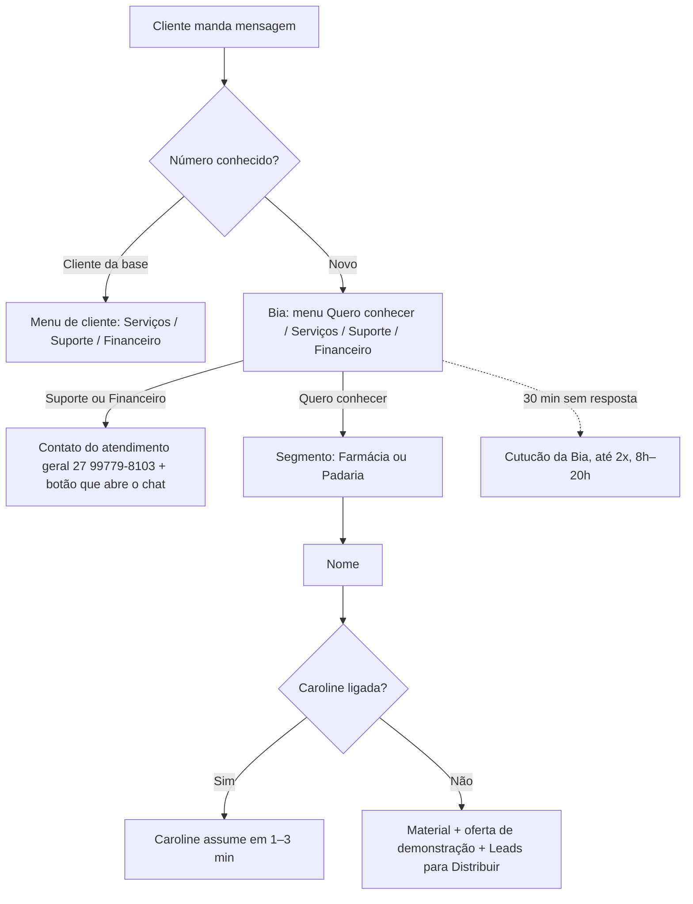
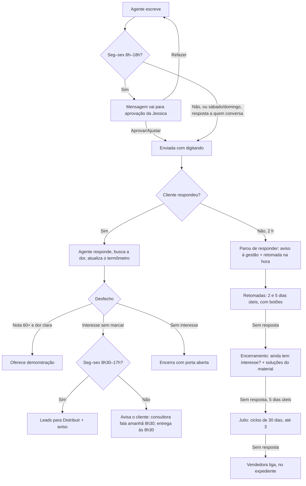
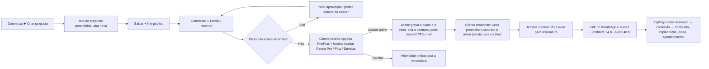

# App flow: CRM Comercial Prosystem

Fluxos do usuário e do cliente · versão 1.0 · 27/09/2026

## 1. Mapa de telas

| Área | Telas principais |
|---|---|
| Comercial | Dashboard, Leads, Leads SDR, Funil, Pipeline comercial, Propostas comerciais, Contratos, Metas, Comissões, Previsão, Ranking |
| Atendimento | WhatsApp (Conversas, Fila de chamados), Atividades, Agenda |
| Agentes | Escritório virtual (sala, agenda de cada agente, painéis da Caroline/Luiz Felipe/Julio, Caderno da Laya, Pesquisas da Sofia) |
| Gestão | Painel CEO, Indicadores, Painel da TV, Relatório comercial, Análise comercial |
| Pós-venda | Implantações, Clientes, Health score, NPS, Churn |
| Sistema | Configurações, Usuários, Auditoria, Manual |

## 2. Fluxo do cliente que chama no WhatsApp

## 3. Fluxo da conversa com um agente (Caroline, Julio, Luiz Felipe)

**Em qualquer ponto:** uma pessoa assume ou responde → os agentes param → ela recebe o resumo no WhatsApp → o lead sai da distribuição.

## 4. Fluxo do Julio (follow-up de leads)

1. Às 9h de seg 28/09 em diante, a fila é abastecida com 2 leads por vez: abertos, com celular, do mais novo para o mais antigo, sem conversa nos últimos 7 dias e sem proposta aberta.
2. Primeiro contato (respeitando o limite único do dia): "como está a rotina, já resolveu a questão do sistema?".
3. Já fechou com outro sistema → anota qual e por quê → encerra.
4. Interesse (nota 35+, "Quero saber mais", "Me chama depois") → **passa para a Caroline**.

## 5. Fluxo do Luiz Felipe (propostas)

1. Proposta enviada pelo WhatsApp → follow-up nos dias 2, 5 e 7.
2. Proposta parada há mais de 7 dias (enviada, visualizada, em negociação, expirada) → retomada pela IA: avaliou? dúvida? fechou com outro?
3. Quer negociar ou fechar → consultora dele é avisada (Luiz nunca fala de valores).

## 6. Fluxo da proposta

## 7. Fluxo do "Me chama depois"

Lead toca **Me chama depois** → nota mínima 35 (morno) → agente oferece **próximo dia útil de manhã ou à tarde** → lead escolhe → confirmação → agente chama às 9h30 ou 14h30 lembrando o combinado.

## 8. Fluxos da supervisora

- **Passar leads para a Caroline:** Escritório → painel da Caroline → colar → Conferir → Confirmar.
- **Aprovar mensagens:** painel do agente → Aprovar / ajustar / 🔄 Refazer ("o que mudar?").
- **Ensinar a Laya:** conversa → painel da Laya → Confirmar ou corrigir (meta 15/dia; lembrete 17h).
- **Assumir:** conversa → ✋ Assumir → recebe o resumo no WhatsApp.
- **Finalizar:** ✅ Finalizar → volta sozinha se o contato escrever.
- **Anotar ligação:** 📝 Observações (CNPJ é consultado na Receita).
- **Acompanhar agentes:** clicar no agente → 📅 Agenda.
- **Notificação de conversas (💬 no topo):** só mensagens de hoje; clicar abre a conversa (`/whatsapp?c=<id>`), marca como lida e tira da lista.

## 9. Fluxo da gestão (diretoria)

- 18h (seg–qui): resumo do dia por e-mail e WhatsApp; sexta: resumo da semana com eficiência.
- Novo contrato assinado: aviso no WhatsApp.
- Comandos: `hoje`, `semana`, `propostas paradas`, `cliente …`, `tarefa …`.

### Atualização 28/09/2026: resposta em até 1 minuto e dúvidas
- Quando o lead ou cliente escreve, a resposta do agente (Caroline, Julio, Luiz Felipe) sai **na hora, sem aprovação, em qualquer horário**: o agente espera 20 s para juntar mensagens seguidas e responde em cerca de 30 a 50 s (máximo ~1 min).
- A aprovação ("Aprovar antes de enviar") vale só para o que o agente puxa sozinho: primeiro contato e retomadas. Retomadas de quem já conversou, fora do horário comercial ou no sábado, também saem direto.
- Dúvida do cliente: (1) o agente procura no material e responde; (2) se não entendeu a pergunta, pergunta mais ao cliente; (3) só se o material não cobrir, avisa que confirma com a equipe (acao `duvida_fora_material`).
- Técnico: `caroline.service.ts` (`semAprovacao` inclui toda `fase === "resposta"`, `ESPERA_MS = 20_000`); `lib/assistente/sdr.ts` (regra NÃO INVENTE NADA reescrita). Sem mudança de schema. Regra também gravada como instrução da equipe no Escritório virtual.

### Atualização 28/09/2026: desistência vira "perdido" com motivo + lista News + Instagram
- Quando o cliente diz que não quer, ou que já fechou com outro sistema, o agente se despede com a porta aberta (sem fazer pergunta nessa despedida) e a IA devolve `motivo_perda` (PRECO | JA_TEM_FORNECEDOR | SEM_ORCAMENTO | TIMING | SEM_INTERESSE | FUNCIONALIDADE_AUSENTE | OUTRO, as mesmas chaves do funil e do relatório comercial).
- Quando há proposta (Luiz Felipe) ou o motivo é JA_TEM_FORNECEDOR, `marcarPerdidoNews` (caroline.service.ts) faz o seguinte:
  - Lead: `status/etapa_funil/etapa_comercial = PERDIDO`, `motivo_perda` recebe "CHAVE: o que o cliente disse", e uma linha é gravada em `LeadPerda`. Se a proposta não tiver lead vinculado, o sistema acha o lead pelo celular (últimos 8 dígitos) ou cria um com origem PROPOSTA.
  - Proposta: `status = PERDIDA` e uma linha em `PropostaHistorico` (tipo STATUS, com o motivo).
  - Etiqueta do sistema **News** (roxa, `sistema=true`) aplicada ao lead.
  - Mensagem automática com o Instagram: https://instagram.com/prosystemoficial.
- Campanhas (Zequinha): novo público **NEWS**, que reúne os leads com a etiqueta News e vem com um modelo de informativo que já traz o Instagram. O "SAIR" continua valendo.
- Sem mudança de schema (usa Etiqueta, LeadEtiquetaAplicada, LeadPerda e PropostaHistorico, que já existiam).

### Atualização 28/09/2026: vídeos e suporte vão para o setor de suporte
- Se o cliente pede vídeos (tutoriais, treinamento, "como usar"), ajuda técnica ou suporte, o agente (Caroline, Julio ou Luiz Felipe) usa a nova ação `encaminhar_suporte`, com `mensagens: []`, e não promete enviar vídeos.
- Em seguida o sistema envia o texto padrão `mensagemSuporte(agente)` (lib/assistente/sdr.ts): "O envio de vídeos, treinamentos e o suporte técnico são feitos pelo nosso setor de suporte. Eu sou o Luiz Felipe, do setor comercial…". A mensagem vai com o botão de link "💬 Falar com o suporte" (`LINK_CONTATO_GERAL`, o mesmo usado na triagem) e fica registrada na conversa.
- A função `encaminharSuporte` fica em caroline.service.ts. O lead continua em CONVERSANDO. Não há mudança de schema.
