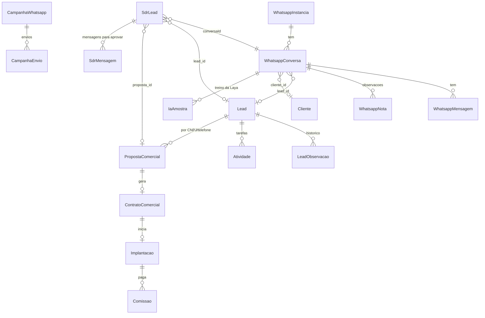

# Esquema do backend: CRM Comercial Prosystem

Versão 1.0 · 27/09/2026 · fonte da verdade: `backend/prisma/schema.prisma` (MySQL, Prisma 5, 91 modelos)

## 1. Diagrama das entidades principais

## 2. Comercial

### Lead (104 campos)
Identificação (`nome`, `razao_social`, `nome_fantasia`, `cnpj`, `empresa`, `segmento`, `cidade`, `estado`), perfil (`qtd_lojas`, `qtd_caixas`, `sistema_atual`), contato (`responsavel_nome`, `responsavel_telefone`, `responsavel_email`, `telefone`, `email`), funil (`etapa_comercial`, `etapa_sdr`, `etapa_funil`, `status`, `status_atendimento`, `temperatura` FRIO|MORNO|QUENTE|MUITO_QUENTE, `probabilidade`, `motivo_perda`), origem (`origem`, `utm_*`, `fbclid`, `campanha_nome`, `plataforma`, `link_origem`), responsável (`responsavel_id`, `vendedor_nome`, `atribuido_em`), fechamento (`fechamento_*`), ZapSign, auditoria (`created_by`, `deleted_at`).
- **"Leads para Distribuir"** = `etapa_sdr = 'QUALIFICADO'` e sem responsável próprio.
- **Nunca apagar** leads antigos (exclusão é lógica, `deleted_at`).

### LeadObservacao
Histórico do lead: `tipo` (SISTEMA, OBSERVACAO…), `descricao`, mudanças de coluna e de temperatura, autor.

### PropostaComercial (79 campos)
Cliente, `plano_selecionado` (BASIC|PRO|PLUS ou nome livre, normalizado por `planoNormal`), `mensalidade_basic/pro/plus`, `valor_implantacao`, `valor_conversao`, `desconto`, `valor_final`, `entrada`, `parcelas`, `valor_parcela`, `validade`, `status` (RASCUNHO, ENVIADA, VISUALIZADA, EM_NEGOCIACAO, ACEITA, CONTRATO_EM_GERACAO, CONTRATO_ENVIADO, CONTRATO_ASSINADO, EXPIRADA, PERDIDA, RECUSADA), `public_token`, comissões, WhatsApp (`wpp_conversa_id`, `wpp_enviada_em`, `wpp_followup_etapa`), desconto aprovado (`desconto_aprov_*`), pós-venda (`wpp_boasvindas_em`, `wpp_pesquisa_*`).

### ContratoComercial (56 campos)
Número, representante, plano, mensalidade, setup, ZapSign (`zapsign_*`, `signed_at`), `status` (…ASSINADO), comissão do vendedor.

- Fluxo de assinatura: `A_GERAR` (esperando dados) → `GERADO` → `ENVIADO_ASSINATURA` (com `zapsign_doc_token`, `zapsign_signing_url`, `sent_to_sign_at`) → `ASSINADO` (via webhook conferido) ou `PENDENTE_CORRECAO` (recusado). Dados de quem assina: `representante_nome`, `representante_cpf`, `representante_email`, `representante_telefone`.

### Implantacao, Comissao, MetaVendedor, Atividade
- `Implantacao`: técnico, etapas, datas, checklist, testes, arquivos.
- `Comissao`: papel (vendedor 15%, supervisão 5%), estágio, mês de pagamento.
- `Atividade`: `tipo`, `status`, `responsavel_id`, `data_prevista`, demo pelo WhatsApp (`whatsapp_conversa_id`, `lembrete_whatsapp_em`).

## 3. WhatsApp

| Modelo | Campos principais |
|---|---|
| **WhatsappInstancia** | `instancia_nome`, `numero`, `instance_token` (UAZAPI), `status` |
| **WhatsappConversa** | `contato_numero`, `contato_nome`, `dono_id` (null = sem dono), `lead_id`, `cliente_id`, `tipo_contato`, `etiqueta`, `prioridade`, `sla_prazo_em`, triagem (`bot_ativo`, `bot_estado`, `bot_dados` com cnpj/receita/cutucadas), cadência, `ia_sugestao` (Laya), `optout_campanhas`, `finalizada_em/por` |
| **WhatsappMensagem** | `direcao` (ENTRADA/SAIDA), `tipo`, `conteudo`, `midia_url`, `transcricao`, `status`, `enviada_por` (null = pessoa; `bot`, `assistente_ia`, `campanha`, `cadencia_automatica`, `caroline`, `julio`, `luiz_felipe`, `abertura_jessica`) |
| **WhatsappNota** | Observações da equipe: `texto`, `autor_*`, `lead_id` |
| **CampanhaWhatsapp / CampanhaEnvio** | Público, texto, status; envio por número com status e data |

## 4. Agentes e IA

| Modelo | Uso |
|---|---|
| **SdrLead** | Fila e estado de cada lead com um agente: `agente` (caroline|julio|luiz_felipe), `proposta_id`, `lead_id`, `conversaId`, `status` (FILA, AGUARDANDO, CONVERSANDO, DEMO, VENDEDORA, SEM_INTERESSE, SEM_RESPOSTA, HUMANO, SAIU), `tentativas`, `primeiro_envio_em`, `ultima_caroline_em` (última fala do agente), `ultima_lead_em`, `nota`, `nota_motivo`, `temperatura`, `temperatura_confirmada`, `resumo`, `desde`, `dados` (JSON: `dor_principal`, `cidade`, `sistema_atual`, `retomar_em`, `combinado`, `parou_em`, `ciclos`, `ciclo_em`, `entregar_em`, `entregue_em`, `intencao`) |
| **SdrMensagem** | Mensagens para aprovação: `texto`, `texto_final` (ajuste ou "o que mudar"), `status` (PENDENTE, APROVADA, EDITADA, DESCARTADA, ENVIADA_AUTO), `acao` (JSON longo, `@db.Text`) |
| **IaAmostra** | Exemplos confirmados pela equipe (treino da Laya): `texto`, `rotulos`, `sugestao` |
| **PesquisaSetor** | Pesquisas da Sofia: `tema`, `titulo`, `resumo`, `itens` (segmento, título, resumo, por que importa, mensagem sugerida), `fontes` |
| **AgenteInstrucao / AgenteMensagem** | Instruções gravadas e conversa com os agentes |

## 5. Configurações (`ConfiguracaoIntegracao`, chave → valor)

| Chave | Conteúdo |
|---|---|
| `assistente.caroline`, `assistente.sdr.julio`, `assistente.sdr.luiz_felipe` | JSON: `ativa`, `aprovar`, `limite`, `ativada_em`, `inicia_em`, `pausada_motivo` |
| `assistente.avisos.<userId>` | Avisos escolhidos por pessoa |
| `assistente.tira_duvidas`, `assistente.transcrever_auto` | Clarice |
| `assistente.pix_chave`, `assistente.gemini_chave` | PIX e chave legada |
| `whatsapp.triagem.*` | Triagem ligada e materiais de farmácia e padaria |
| `ia.uso.<AAAA-MM-DD>` | Contagem OpenAI/Grok/Laya |
| `envio.<chave>` | Trava contra mensagens repetidas (data do último envio) |

## 6. Demais domínios (resumo)

- **Clientes e retenção:** Cliente (71 campos, incluindo `ddd` e telefones), ContatoCliente, CasoChurn, PlanoRetencao, HealthScore, CsatSurvey, PesquisaSatisfacao.
- **Usuários e segurança:** UsuarioCRM (`cargo`, `telefone`, `vende`, `admin_sistema`, `somente_leitura`), AuditoriaUsuario, CalendarToken.
- **Marketing legado:** Campanha, SequenciaEmail, Template.
- **Gestão:** IndicadorMensalCEO, RelatorioComercial, ResultadoAnualHistorico, LancamentoFinanceiro.
- **Conhecimento:** KbCategoria, KbArtigo.

## 7. Regras de mudança no banco

- Só mudanças **aditivas** (novas tabelas, colunas opcionais, alargar tipo); o deploy bloqueia qualquer diferença fora da lista autorizada.
- Backup (`mysqldump`) antes de cada publicação.
- Toda mudança de esquema atualiza este documento.

### Atualização 28/09/2026: resposta em até 1 minuto e dúvidas
- Quando o lead ou cliente escreve, a resposta do agente (Caroline, Julio, Luiz Felipe) sai **na hora, sem aprovação, em qualquer horário**: o agente espera 20 s para juntar mensagens seguidas e responde em cerca de 30 a 50 s (máximo ~1 min).
- A aprovação ("Aprovar antes de enviar") vale só para o que o agente puxa sozinho: primeiro contato e retomadas. Retomadas de quem já conversou, fora do horário comercial ou no sábado, também saem direto.
- Dúvida do cliente: (1) o agente procura no material e responde; (2) se não entendeu a pergunta, pergunta mais ao cliente; (3) só se o material não cobrir, avisa que confirma com a equipe (acao `duvida_fora_material`).
- Técnico: `caroline.service.ts` (`semAprovacao` inclui toda `fase === "resposta"`, `ESPERA_MS = 20_000`); `lib/assistente/sdr.ts` (regra NÃO INVENTE NADA reescrita). Sem mudança de schema. Regra também gravada como instrução da equipe no Escritório virtual.
