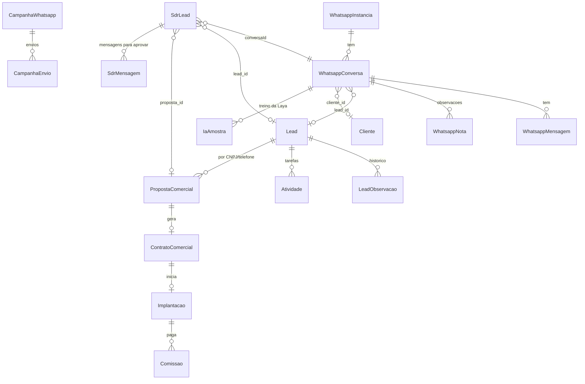

# Esquema do backend: CRM Comercial Prosystem

Versão 1.0 · 27/09/2026 · fonte da verdade: `backend/prisma/schema.prisma` (MySQL, Prisma 5, 91 modelos)

## 1. Diagrama das entidades principais

## 2. Comercial

### Lead (104 campos)
Identificação (`nome`, `razao_social`, `nome_fantasia`, `cnpj`, `empresa`, `segmento`, `cidade`, `estado`), perfil (`qtd_lojas`, `qtd_caixas`, `sistema_atual`), contato (`responsavel_nome`, `responsavel_telefone`, `responsavel_email`, `telefone`, `email`), funil (`etapa_comercial`, `etapa_sdr`, `etapa_funil`, `status`, `status_atendimento`, `temperatura` FRIO|MORNO|QUENTE|MUITO_QUENTE, `probabilidade`, `motivo_perda`), origem (`origem`, `utm_*`, `fbclid`, `campanha_nome`, `plataforma`, `link_origem`), responsável (`responsavel_id`, `vendedor_nome`, `atribuido_em`), fechamento (`fechamento_*`), ZapSign, auditoria (`created_by`, `deleted_at`).
- **"Leads para Distribuir"** = `etapa_sdr = 'QUALIFICADO'` e sem responsável próprio.
- **Nunca apagar** leads antigos (exclusão é lógica, `deleted_at`).

### LeadObservacao
Histórico do lead: `tipo` (SISTEMA, OBSERVACAO…), `descricao`, mudanças de coluna e de temperatura, autor.

### PropostaComercial (79 campos)
Cliente, `plano_selecionado` (BASIC|PRO|PLUS ou nome livre, normalizado por `planoNormal`), `mensalidade_basic/pro/plus`, `valor_implantacao`, `valor_conversao`, `desconto`, `valor_final`, `entrada`, `parcelas`, `valor_parcela`, `validade`, `status` (RASCUNHO, ENVIADA, VISUALIZADA, EM_NEGOCIACAO, ACEITA, CONTRATO_EM_GERACAO, CONTRATO_ENVIADO, CONTRATO_ASSINADO, EXPIRADA, PERDIDA, RECUSADA), `public_token`, comissões, WhatsApp (`wpp_conversa_id`, `wpp_enviada_em`, `wpp_followup_etapa`), desconto aprovado (`desconto_aprov_*`), pós-venda (`wpp_boasvindas_em`, `wpp_pesquisa_*`).

### ContratoComercial (56 campos)
Número, representante, plano, mensalidade, setup, ZapSign (`zapsign_*`, `signed_at`), `status` (…ASSINADO), comissão do vendedor.

- Fluxo de assinatura: `A_GERAR` (esperando dados) → `GERADO` → `ENVIADO_ASSINATURA` (com `zapsign_doc_token`, `zapsign_signing_url`, `sent_to_sign_at`) → `ASSINADO` (via webhook conferido) ou `PENDENTE_CORRECAO` (recusado). Dados de quem assina: `representante_nome`, `representante_cpf`, `representante_email`, `representante_telefone`.

### Implantacao, Comissao, MetaVendedor, Atividade
- `Implantacao`: técnico, etapas, datas, checklist, testes, arquivos.
- `Comissao`: papel (vendedor 15%, supervisão 5%), estágio, mês de pagamento.
- `Atividade`: `tipo`, `status`, `responsavel_id`, `data_prevista`, demo pelo WhatsApp (`whatsapp_conversa_id`, `lembrete_whatsapp_em`).

## 3. WhatsApp

| Modelo | Campos principais |
|---|---|
| **WhatsappInstancia** | `instancia_nome`, `numero`, `instance_token` (UAZAPI), `status` |
| **WhatsappConversa** | `contato_numero`, `contato_nome`, `dono_id` (null = sem dono), `lead_id`, `cliente_id`, `tipo_contato`, `etiqueta`, `prioridade`, `sla_prazo_em`, triagem (`bot_ativo`, `bot_estado`, `bot_dados` com cnpj/receita/cutucadas), cadência, `ia_sugestao` (Laya), `optout_campanhas`, `finalizada_em/por` |
| **WhatsappMensagem** | `direcao` (ENTRADA/SAIDA), `tipo`, `conteudo`, `midia_url`, `transcricao`, `status`, `enviada_por` (null = pessoa; `bot`, `assistente_ia`, `campanha`, `cadencia_automatica`, `caroline`, `julio`, `luiz_felipe`, `abertura_jessica`) |
| **WhatsappNota** | Observações da equipe: `texto`, `autor_*`, `lead_id` |
| **CampanhaWhatsapp / CampanhaEnvio** | Público, texto, status; envio por número com status e data |

## 4. Agentes e IA

| Modelo | Uso |
|---|---|
| **SdrLead** | Fila e estado de cada lead com um agente: `agente` (caroline|julio|luiz_felipe), `proposta_id`, `lead_id`, `conversaId`, `status` (FILA, AGUARDANDO, CONVERSANDO, DEMO, VENDEDORA, SEM_INTERESSE, SEM_RESPOSTA, HUMANO, SAIU), `tentativas`, `primeiro_envio_em`, `ultima_caroline_em` (última fala do agente), `ultima_lead_em`, `nota`, `nota_motivo`, `temperatura`, `temperatura_confirmada`, `resumo`, `desde`, `dados` (JSON: `dor_principal`, `cidade`, `sistema_atual`, `retomar_em`, `combinado`, `parou_em`, `ciclos`, `ciclo_em`, `entregar_em`, `entregue_em`, `intencao`) |
| **SdrMensagem** | Mensagens para aprovação: `texto`, `texto_final` (ajuste ou "o que mudar"), `status` (PENDENTE, APROVADA, EDITADA, DESCARTADA, ENVIADA_AUTO), `acao` (JSON longo, `@db.Text`) |
| **IaAmostra** | Exemplos confirmados pela equipe (treino da Laya): `texto`, `rotulos`, `sugestao` |
| **PesquisaSetor** | Pesquisas da Sofia: `tema`, `titulo`, `resumo`, `itens` (segmento, título, resumo, por que importa, mensagem sugerida), `fontes` |
| **AgenteInstrucao / AgenteMensagem** | Instruções gravadas e conversa com os agentes |

## 5. Configurações (`ConfiguracaoIntegracao`, chave → valor)

| Chave | Conteúdo |
|---|---|
| `assistente.caroline`, `assistente.sdr.julio`, `assistente.sdr.luiz_felipe` | JSON: `ativa`, `aprovar`, `limite`, `ativada_em`, `inicia_em`, `pausada_motivo` |
| `assistente.avisos.<userId>` | Avisos escolhidos por pessoa |
| `assistente.tira_duvidas`, `assistente.transcrever_auto` | Clarice |
| `assistente.pix_chave`, `assistente.gemini_chave` | PIX e chave legada |
| `whatsapp.triagem.*` | Triagem ligada e materiais de farmácia e padaria |
| `ia.uso.<AAAA-MM-DD>` | Contagem OpenAI/Grok/Laya |
| `envio.<chave>` | Trava contra mensagens repetidas (data do último envio) |

## 6. Demais domínios (resumo)

- **Clientes e retenção:** Cliente (71 campos, incluindo `ddd` e telefones), ContatoCliente, CasoChurn, PlanoRetencao, HealthScore, CsatSurvey, PesquisaSatisfacao.
- **Usuários e segurança:** UsuarioCRM (`cargo`, `telefone`, `vende`, `admin_sistema`, `somente_leitura`), AuditoriaUsuario, CalendarToken.
- **Marketing legado:** Campanha, SequenciaEmail, Template.
- **Gestão:** IndicadorMensalCEO, RelatorioComercial, ResultadoAnualHistorico, LancamentoFinanceiro.
- **Conhecimento:** KbCategoria, KbArtigo.

## 7. Regras de mudança no banco

- Só mudanças **aditivas** (novas tabelas, colunas opcionais, alargar tipo); o deploy bloqueia qualquer diferença fora da lista autorizada.
- Backup (`mysqldump`) antes de cada publicação.
- Toda mudança de esquema atualiza este documento.

### Atualização 28/09/2026: resposta em até 1 minuto e dúvidas
- Quando o lead ou cliente escreve, a resposta do agente (Caroline, Julio, Luiz Felipe) sai **na hora, sem aprovação, em qualquer horário**: o agente espera 20 s para juntar mensagens seguidas e responde em cerca de 30 a 50 s (máximo ~1 min).
- A aprovação ("Aprovar antes de enviar") vale só para o que o agente puxa sozinho: primeiro contato e retomadas. Retomadas de quem já conversou, fora do horário comercial ou no sábado, também saem direto.
- Dúvida do cliente: (1) o agente procura no material e responde; (2) se não entendeu a pergunta, pergunta mais ao cliente; (3) só se o material não cobrir, avisa que confirma com a equipe (acao `duvida_fora_material`).
- Técnico: `caroline.service.ts` (`semAprovacao` inclui toda `fase === "resposta"`, `ESPERA_MS = 20_000`); `lib/assistente/sdr.ts` (regra NÃO INVENTE NADA reescrita). Sem mudança de schema. Regra também gravada como instrução da equipe no Escritório virtual.

### Atualização 28/09/2026: desistência vira "perdido" com motivo + lista News + Instagram
- Quando o cliente diz que não quer, ou que já fechou com outro sistema, o agente se despede com a porta aberta (sem fazer pergunta nessa despedida) e a IA devolve `motivo_perda` (PRECO | JA_TEM_FORNECEDOR | SEM_ORCAMENTO | TIMING | SEM_INTERESSE | FUNCIONALIDADE_AUSENTE | OUTRO, as mesmas chaves do funil e do relatório comercial).
- Quando há proposta (Luiz Felipe) ou o motivo é JA_TEM_FORNECEDOR, `marcarPerdidoNews` (caroline.service.ts) faz o seguinte:
  - Lead: `status/etapa_funil/etapa_comercial = PERDIDO`, `motivo_perda` recebe "CHAVE: o que o cliente disse", e uma linha é gravada em `LeadPerda`. Se a proposta não tiver lead vinculado, o sistema acha o lead pelo celular (últimos 8 dígitos) ou cria um com origem PROPOSTA.
  - Proposta: `status = PERDIDA` e uma linha em `PropostaHistorico` (tipo STATUS, com o motivo).
  - Etiqueta do sistema **News** (roxa, `sistema=true`) aplicada ao lead.
  - Mensagem automática com o Instagram: https://instagram.com/prosystemoficial.
- Campanhas (Zequinha): novo público **NEWS**, que reúne os leads com a etiqueta News e vem com um modelo de informativo que já traz o Instagram. O "SAIR" continua valendo.
- Sem mudança de schema (usa Etiqueta, LeadEtiquetaAplicada, LeadPerda e PropostaHistorico, que já existiam).

### Atualização 28/09/2026: vídeos e suporte vão para o setor de suporte
- Se o cliente pede vídeos (tutoriais, treinamento, "como usar"), ajuda técnica ou suporte, o agente (Caroline, Julio ou Luiz Felipe) usa a nova ação `encaminhar_suporte`, com `mensagens: []`, e não promete enviar vídeos.
- Em seguida o sistema envia o texto padrão `mensagemSuporte(agente)` (lib/assistente/sdr.ts): "O envio de vídeos, treinamentos e o suporte técnico são feitos pelo nosso setor de suporte. Eu sou o Luiz Felipe, do setor comercial…". A mensagem vai com o botão de link "💬 Falar com o suporte" (`LINK_CONTATO_GERAL`, o mesmo usado na triagem) e fica registrada na conversa.
- A função `encaminharSuporte` fica em caroline.service.ts. O lead continua em CONVERSANDO. Não há mudança de schema.

### Atualização 28/09/2026: conversa mais simples, direta e com os desafios da farmácia
- **Menos perguntas:** no máximo 2 perguntas de investigação na conversa inteira, e nunca repetir uma pergunta já respondida. Assim que o cliente diz qual é o problema, mesmo numa palavra ("demora"), o agente mostra em 1 ou 2 frases como o MATERIAL resolve e já oferece a demonstração (`oferecer_demo`, sem esperar a nota 60).
- **Resposta curta** ("nada", "isso") é tratada como sinal de pouca paciência: nada de mais perguntas abertas, o agente vai direto para a solução e a demonstração.
- **Pergunta direta:** "Qual é o maior problema que você quer resolver hoje na farmácia?", com o convite para explicar por áudio (os áudios são transcritos).
- **Dia a dia da farmácia (conhecimento geral)**, usado de forma natural, um exemplo por vez:
  - fila e demora no caixa;
  - estoque furado e remédio vencendo;
  - controlados e receitas (SNGPC);
  - convênios, PBM e Farmácia Popular;
  - fiado e crediário;
  - margem e preço;
  - cliente de uso contínuo que não volta;
  - fechamento de caixa;
  - nota fiscal e impostos.
- A solução para cada um desses problemas só vem do MATERIAL.
- Onde está no código: `promptCaroline` em lib/assistente/sdr.ts. Não há mudança de schema.

### Atualização 28/09/2026: pedido de prazo sempre com previsão + campanha/revisão com autorização
- **Luiz Felipe:** quando o cliente pede mais prazo, o agente nunca sai só agradecendo. Ele pede uma previsão ("pra quando você acha que consegue decidir? assim já te chamo nesse dia"), confirma a data e deixa a porta aberta.
- **Do dia 20 ao último dia do mês** (`janelaCampanhaAtiva`, horário de Brasília), ele também diz que temos campanhas ativas e que pode revisar a proposta, sem citar valores. Essa mensagem vem marcada com `revisar_proposta: true`, e aí:
  - ela sempre vai para "✋ Para você aprovar", mesmo sendo uma resposta;
  - a Jessica recebe um aviso no WhatsApp ("🙋 Autorização: … quer oferecer revisão da proposta") com o texto;
  - fora da janela, uma mensagem com essa marcação é descartada e nunca sai.
- **Código:** `promptCaroline` (parâmetro `janelaCampanha`) e `lerRespostaCaroline` em lib/assistente/sdr.ts; `falar` em caroline.service.ts. Não há mudança de schema.

### Atualização 28/09/2026: máquina de negociação do Luiz Felipe (autorização por botão no WhatsApp)
- **Pedido de autorização:** quando o Luiz marca uma mensagem com `revisar_proposta` (entre o dia 20 e o fim do mês, uma vez por mês por cliente), a mensagem fica PENDENTE e `pedirAutorizacaoNegociacao` (assistente-negociacao.service.ts) envia para a gestão, só a quem recebe o aviso `lead_qualificado` (o Thiago não recebe), um menu com:
  - a prévia da proposta: empresa, contato, plano, mensalidade, implantação e link;
  - a mensagem que vai para o cliente;
  - as opções de desconto: implantação -30% ou -20% e mensalidade -10% por 12 meses, com os valores de antes e depois.
- **Botões** (`lib/assistente/negociacao.ts`): `neg_30_<msgId>` "✅ Autorizar 30%", `neg_20_<msgId>` "✅ Autorizar 20%" e `neg_0_<msgId>` "❌ Não autorizar". `responderComandoGestao` encaminha para `responderAutorizacaoNegociacao`:
  - **Autorizar:** grava `SdrLead.dados.desconto_autorizado` (impl_pct, mens_pct 10, meses 12, valores de antes e depois, quem autorizou) e `campanha_mes`, aprova a mensagem (`decidirMensagem`) e confirma para a gestora.
  - **Não autorizar:** a mensagem sai trocada só pelo pedido de previsão de decisão e o cliente fica marcado com `campanha_recusada` no mês.
- **Com desconto autorizado:** o prompt do Luiz recebe `instrucaoDescontoAutorizado`, que manda ser comercial e conduzir ao fechamento. Ele apresenta a condição só em porcentagem, como campanha válida até o fim do mês. Se o cliente topar, usa a ação `aceitar_condicao`.
- **`aceitar_condicao` → `aplicarCondicaoNaProposta`:**
  - na proposta: `desconto` = X% da implantação, `valor_final` recalculado, `condicao_especial` com a mensalidade -10% por 12 meses, `desconto_aprov_status=APROVADO`, status EM_NEGOCIACAO e histórico RENEGOCIACAO;
  - reenvio pelo WhatsApp (`enviarPropostaWhatsapp`) com os botões de aceite de sempre, mais o texto "Condição da campanha aplicada";
  - aviso 🔥 para a gestão.
- **Sem desconto autorizado,** o Luiz continua proibido de oferecer valores ou condições.
- Não há mudança de schema. Teste: tests/negociacao.test.ts.

### Atualização 28/09/2026: campanha negociada vale 5 dias corridos
- A condição autorizada vale `VALIDADE_CAMPANHA_DIAS = 5` dias corridos, contados a partir do momento da autorização (`desconto_autorizado.em`). As funções `validadeCampanha` e `campanhaVigente` ficam em lib/assistente/negociacao.ts.
- O Luiz apresenta a condição como "válida por 5 dias (até DD/MM)". O texto "Condição da campanha aplicada" mostra a mesma data, e a confirmação enviada à gestora também.
- Passados os 5 dias, a condição deixa de ir para o prompt e `aplicarCondicaoNaProposta` recusa a aplicação.
- A oferta ao cliente passou a dizer "campanha ativa por poucos dias", no lugar de "campanhas ativas este mês".

### Atualização 28/09/2026: cliente nunca fica órfão por mensagem mandada do celular
- **Causa:** a Jessica mandou uma mensagem pelo celular sem assumir a conversa no CRM. `pessoaAssumiu` tratava isso como se uma pessoa tivesse assumido: o agente virava HUMANO, a conversa ficava sem dono e ninguém respondia o cliente.
- **Correção em `pessoaAssumiu`** (caroline.service.ts): o dono no CRM continua valendo como assumido. Já uma mensagem humana sem dono só conta como "pessoa conversando" se tiver sido enviada nos últimos 10 minutos.
- **Correção em `aoReceberDoLead`:** o SdrLead HUMANO volta para CONVERSANDO e o agente responde quando as quatro condições valem:
  - o cliente escreveu;
  - a conversa não tem dono;
  - a conversa não foi finalizada;
  - ninguém conversou nos últimos 10 minutos.
- A regra "uma pessoa assumiu, nenhum agente responde" continua valendo para quem assume pelo CRM (fica como dono) e para a conversa finalizada.
- Não há mudança de schema.

### Atualização 28/09/2026: lembrete da demonstração para a responsável
- As demonstrações marcadas pelo lead já eram gravadas como Atividade (tipo REUNIAO, `created_by = lead_whatsapp`) e aparecem na Agenda da responsável: o dono da conversa ou, sem dono, a Supervisão Comercial.
- **Novo:** `lembrarResponsavelDemo` (assistente-demo.service.ts) roda no agendador do assistente a cada 10 minutos. Quando uma reunião ativa começa em até 75 minutos, a responsável recebe no WhatsApp dela um aviso com:
  - "⏰ Lembrete: demonstração às HH:MM";
  - o título da reunião;
  - o nome e o número do cliente;
  - o link da reunião ou, se não houver, um alerta para enviá-lo.
- O aviso chega entre 65 e 75 minutos antes, portanto sempre com pelo menos 1 hora de antecedência. É uma vez só por reunião (trava `lembrete_demo_resp.<id>`).
- O lembrete do cliente, 2 horas antes, continua como estava. Não há mudança de schema.

### Atualização 28/09/2026: CRM como app de iPhone no celular (etapa 1 de 4)
- **Base:** guia de interface da Apple (HIG iOS), usado a partir de `reference/ios.md` das skills impeccable e anti-ui-slop. Vale só abaixo de 768px; no computador nada muda.
- **Barra de abas embaixo** (`components/mobile/AppIOS.tsx` › `BarraAbasIOS`):
  - WhatsApp, Leads, Propostas (gerador), Dashboard e Mais;
  - material translúcido com blur e linha fina de separação;
  - alvos de toque de 44pt, ícones de 24px e rótulos de 10px;
  - cor de ação azul do sistema (#007AFF, ou #0A84FF no escuro);
  - área segura da barra de início respeitada.
  - Uma aba só aparece se a pessoa tiver permissão para a tela, pelo mesmo filtro do menu (`gruposVisiveis`).
- **Folha "Mais"** (`FolhaMaisIOS`): sobe de baixo com alça e botão fechar, e traz o título grande "Mais". Mostra todas as outras telas liberadas em listas agrupadas no estilo Ajustes (ícone em quadrado arredondado, linha de 44pt, seta), com animação de folha iOS e respeito a `prefers-reduced-motion`.
- **Estrutura:** o menu hambúrguer foi escondido (a aba "Mais" substitui). A barra de cima respeita o notch e a Dynamic Island. O conteúdo tem espaço embaixo para a barra de abas, e a fonte do sistema (San Francisco) vale no celular.
- **Estilos** em `app/ios.css`, com tokens `--ios-*` para os modos claro e escuro (`.dark`).
- **Instalação na tela inicial:**
  - `app/manifest.ts`: standalone, `start_url` /whatsapp, ícones de 192 e 512 (também maskable);
  - `apple-touch-icon.png` de 180px, com a marca ▶ da Prosystem sobre fundo branco;
  - `appleWebApp` com o título "CRM Prosystem".
- **Próximas etapas:**
  - 2: WhatsApp e Leads (títulos grandes, listas e folhas);
  - 3: Propostas e Dashboard;
  - 4: telas do "Mais".

### Atualização 28/09/2026: celular no padrão iOS, etapa 2 (WhatsApp e Leads)
Tudo vale só abaixo de 768px, com classes `ios-*` em `app/ios.css`. No computador nada muda.
- **WhatsApp, lista** (estilo app Mensagens):
  - título grande "WhatsApp" de 34pt;
  - Conversas/Fila e Minhas/Sem dono/Todas/Finalizadas viram controles segmentados;
  - campo de busca iOS (preenchimento cinza, 17pt);
  - linhas de 76pt com avatar de 52pt e separador recuado;
  - selo "Conectado" e faixa "WhatsApp da empresa" escondidos no celular.
- **WhatsApp, conversa** (estilo iMessage):
  - a barra de abas some (classe `ios-em-chat` no body);
  - barra de navegação translúcida com "‹ Conversas", nome, ⓘ (detalhes) e ⋯ (ações);
  - bolhas de 18pt de raio, enviadas em azul do sistema e recebidas em cinza #E9E9EB, texto de 17pt;
  - campo de mensagem em pílula na barra translúcida, com área segura.
- **Folha de ações ⋯** (padrão action sheet): Assumir, Finalizar/Reabrir, Detalhes do atendimento, Prioridade, Etiquetar, Agendar reunião, Vincular a cliente da base, Transferir, Desvincular do funil, Excluir (em vermelho) e Cancelar. A fileira de botões só aparece no computador (`hidden md:contents`).
- **Detalhes ⓘ:** o painel lateral (Criar proposta, Observações, IA, funil etc.) abre como folha em tela cheia, com cabeçalho "Detalhes" e botão OK (estado `painelMobile`).
- **Leads:**
  - título grande "Central de Leads";
  - busca iOS em linha própria;
  - filtros como pílulas em faixa rolável horizontal;
  - "Novo Lead" em azul do sistema;
  - funil com uma etapa por página (coluna com a largura da tela e rolagem com encaixe), navegando pelas setas de 44pt, pelos pontos ou deslizando.
  - O passo das setas passou a medir a largura real da coluna (`colWidth()`), o que vale para o computador e para o celular.
- **Próximas etapas:**
  - 3: Propostas (gerador) e Dashboard;
  - 4: telas do "Mais".

### Atualização 29/09/2026: celular no padrão iOS, etapa 3 (Propostas e Dashboard)
Tudo vale só abaixo de 768px (`app/ios.css`). No computador nada muda.
- **Classes genéricas para outras telas:**
  - `ios-tela`: fundo agrupado #F2F2F7; os `.ps-card` viram cartões iOS com raio de 12, sem borda e sem sombra.
  - `ios-topo`: cabeçalho em coluna, com título grande de 34pt e subtítulo de 15pt.
  - `ios-seg-inline` e `ios-abas`: controles segmentados.
  - `ios-filtros`: busca iOS em linha própria e campos de 36 a 44pt.
  - `ios-lista-cartoes`: a tabela vira lista de cartões, com cabeçalho escondido, uma linha por cartão e botões de ação de 44pt.
  - `ios-modal-*`: o modal vira folha em tela cheia.
- **Propostas (gerador):**
  - título grande "Gerador de Proposta Comercial";
  - Lista/Kanban como segmentado;
  - "Nova Proposta" em botão largo azul do sistema, com 44pt;
  - indicadores em cartões iOS;
  - lista de propostas em cartões: empresa em 17pt, detalhes em 15pt e ações Ver/Editar/Link/WhatsApp com 44pt.
- **Formulário da proposta em folha de tela cheia:**
  - barra de título translúcida com área segura e botão fechar redondo;
  - passos com 44pt e a cor de ação do sistema;
  - campos em uma coluna, de 17pt e 44pt de altura (o `gridColumn: span 2` do FormField é anulado no celular);
  - botões do rodapé com 44pt.
- **Dashboard:**
  - título grande "Dashboard Executivo";
  - filtros e Atualizar com 36pt;
  - abas (`AbaTabs`) como segmentado rolável, com a aba ativa em cartão branco;
  - cartões iOS;
  - barras horizontais com rótulo de 92px para caber na tela.
- **Próxima:** etapa 4, com as telas do "Mais" (Escritório, Agenda, Contratos etc.), usando as classes genéricas.
